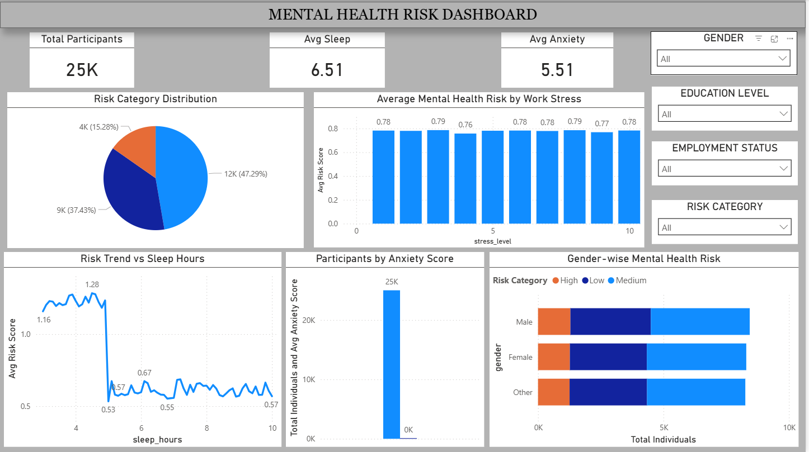

# Mental Health Risk Analysis & Prediction

## Project Overview

This project started as an attempt to understand how different work and lifestyle factors affect mental health. Instead of just looking at numbers, the goal was to find patterns that actually make sense in real life — things like long working hours, poor sleep, and work-life balance.

The project includes data cleaning, exploratory data analysis, a machine learning model to predict mental health risk, and a Power BI dashboard to visualize the insights in a simple way.

---

## Project Components

The project is divided into a few main parts:

* Data cleaning and preprocessing
* Exploratory Data Analysis (EDA)
* Mental health risk prediction model
* Power BI dashboard for visualization
* Insights and findings from the data

---

## Tools and Technologies

The following tools were used in this project:

* Python (Pandas, NumPy, Scikit-learn)
* Power BI
* Streamlit
* Matplotlib / Seaborn
* GitHub

---

## Dashboard Preview



---

## Project Structure

```
mental-health-analysis
│
├── data
├── notebooks
├── powerbi
├── images
├── app
├── requirements.txt
└── README.md
```

---

## Key Insights

Some patterns that were noticed during the analysis:

* People working more than 9 hours a day tend to report higher stress levels.
* Sleep duration has a strong relationship with mental health risk.
* Remote workers, on average, showed slightly lower stress levels.
* Work-life balance turned out to be one of the biggest factors affecting mental health.

These are not absolute conclusions, but they give a good idea of how lifestyle and work habits can influence mental health.

---

## Author
Shubham Panchal

Aspiring Data Analyst | Data Science and Machine Learning
Focused on building real-world data projects and improving practical skills.

LinkedIn:
[www.linkedin.com/in/shubham-panchal-a100282a8](http://www.linkedin.com/in/shubham-panchal-a100282a8)
